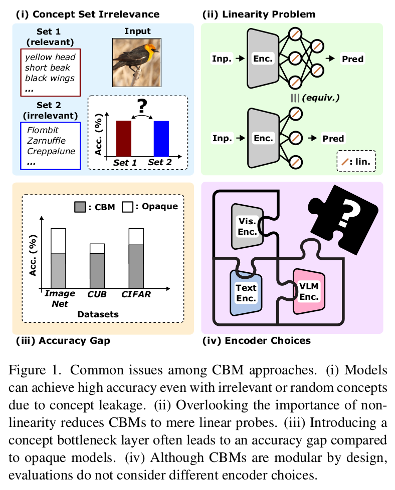
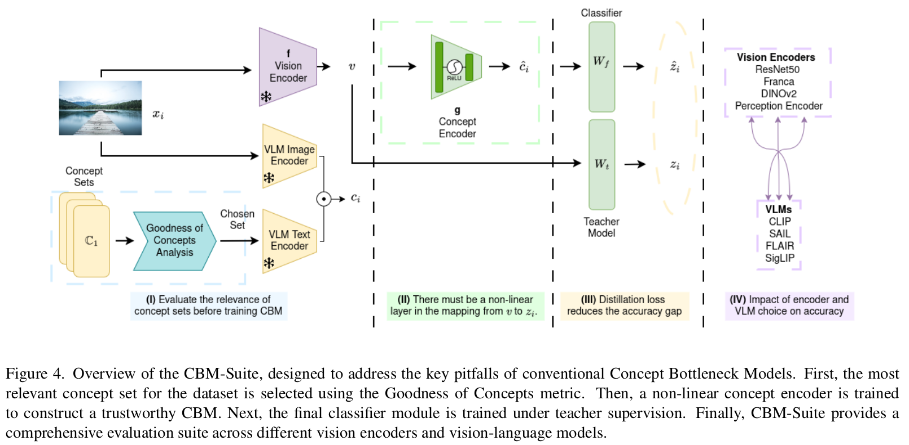

# CBM-Suite

Official implementation of the CVPR 2026 paper: **[Rethinking Concept Bottleneck Models: From Pitfalls to Solutions](https://arxiv.org/abs/2603.05629)**

Concept Bottleneck Models promise interpretability—but do they really use concepts?
We uncover the linearity problem and introduce CBM-Suite for more reliable and accurate CBMs.

This codebase builds on top of [Label-Free CBM](https://github.com/Trustworthy-ML-Lab/Label-free-CBM) (Oikarinen et al., ICLR 2023).

## Motivation

Recent VLM-based CBMs suffer from several limitations:
- No principled concept evaluation
- Linearity problem (models ignore concepts)
- Accuracy gap vs opaque models
- Missing systematic study of encoder and VLM effects on CBMs

<p align="center">
    
</p>

## CBM-Suite

We propose a unified framework that:

- Evaluates concept quality via an entropy-based metric
- Enforces non-linear concept encoding
- Uses knowledge distillation to recover accuracy
- Systematically studies backbones and VLMs

<p align="center">
    
</p>

## Supported Backbones & VLMs

**Backbones** (`--backbone`):
- CLIP as backbone — `clip_<name>`, e.g. `clip_RN50`, `clip_ViT-B/16`
- Any torchvision classification model, e.g. `resnet18`, `resnet50`, `resnet101` (append `_v2` for ImageNet1K_V2 weights)
- `resnet18_places` — ResNet-18 trained on Places365
- `resnet18_cub` — ResNet-18 trained on CUB-200-2011
- `dinov2` — DINOv2 (ViT-S/14)
- `perception_encoder` — Meta Perception Encoder (PE-Core-L14-336)
- `franca` — Franca (ViT-L)

**VLMs** (`--vlm_name`):
- Standard CLIP — any OpenAI CLIP model name, e.g. `ViT-B/16`, `ViT-L/14`, `RN50`
- `SAIL`
- `SigLIP`
- `FLAIR`

## Key Results

- Detects poor concept sets before training  
- Ensures models rely on concepts  
- Narrows the gap to opaque classifiers  
- Achieves strong performance across datasets


## Update

We note a correction regarding the CUB200 experiments:

- The best-performing result reported for CUB200 uses the **Perception Encoder backbone**, not ResNet-18 as originally stated.

This does not affect the overall conclusions of the paper, but clarifies the configuration used for the reported performance.

## Citation

If you find this work useful, please cite:

```bibtex
@inproceedings{tapli2026rethinking,
  title={Rethinking Concept Bottleneck Models: From Pitfalls to Solutions},
  author={Tapli, Merve and Bouniot, Quentin and Stammer, Wolfgang and Akata, Zeynep and Akbas, Emre},
  booktitle={Proceedings of the IEEE/CVF Conference on Computer Vision and Pattern Recognition (CVPR)},
  year={2026}
}
```